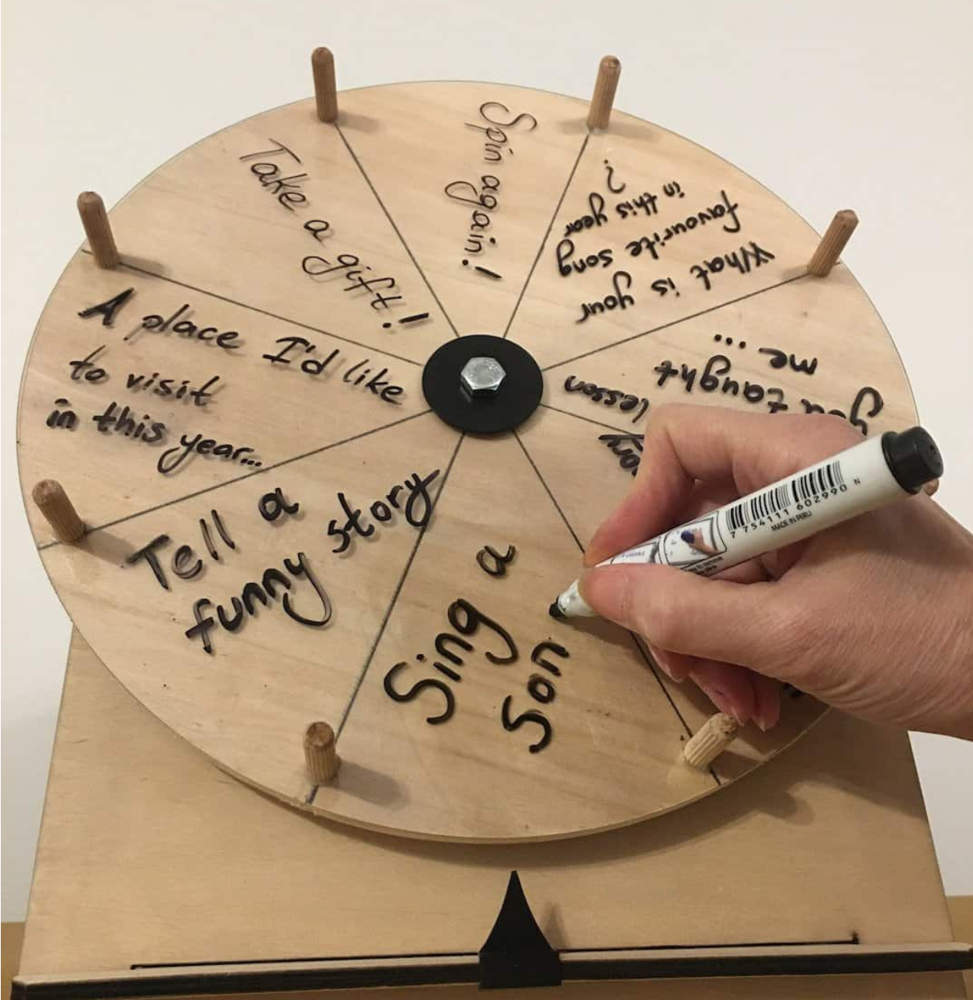

For this assignment, you will be thinking about the game design process, starting from a hypothesis and improving a game through prototyping and playtesting.

1. Identify two different “problems” in two **DIFFERENT** games. By problem, I mean an aspect of a game that frustrated you, made you stop playing or made it more difficult for you to enjoy the game.   
     
   Try to choose meaningful problems (don’t choose something with a simple fix, eg bugs, or cutscene was too long). If you need inspiration, consider games that you quit before finishing, or games that you’ve repeatedly had bad experiences with.

	For each of these problems explain:

	1. **The Target Experience**: What’s the game and the desired (as far as you can tell) player experience?  
	2. **The Experiential Problem**: What’s wrong with the game? Where is the game losing you or frustrating you?  
	3. **The Cause**: What is the root cause of your frustration? Are you unclear about what to do next? Is some feature of the game interfering with your ability to move forward?  
	4. **The Hypothesis**: What’s your hypothesis on how to fix this issue?  
	5. **The Prototype**: What’s the fastest way to prototype this solution?  
	6. **The Playtest Script**: How would you present the prototype to playtesters? What questions would you ask them?

2. (Due 3/3) Do the same things, but for your adaptation of Crazy Eights. Identify a problem, walk through all the above steps, then actually run your playtest with a group of playtesters. Add two additional steps:
   1. **The Analysis**: What kind of feedback did you get? What did you observe? Was your hypothesis correct?
   2. **The Iteration**: Based on your analysis, what would you do next to continue to improve the game?
	  
	This may seem like a lot of steps for one game, but I promise this is close to the actual professional experience of being a game designer. As you improve at your craft, you may begin to intuitively combine some of these steps in your head, but for now, try to be meticulous in practicing the full process.

---

Here’s an example solution for problem 1:

**Monopoly**

**The Target Experience**  
Monopoly is a game about land ownership and exploitation. The goal of the game is to bankrupt your opponents and be the last, richest person standing. [Original game design intent aside](https://en.wikipedia.org/wiki/History_of_Monopoly), I assume the desired player experience is to feel like you can outwit your opponents, and through a combination of luck and skill, claw your way to the top.

**The Experiential Problem**  
Monopoly fails to engage me because the game feels almost entirely luck and no skill. I feel frustrated when I play because I feel like I can predict the outcome of the game based on who purchases the “best” properties, then we spend several hours just playing out the inevitable probabilities. 

**The Cause**  
In monopoly, players collect rent from opponents when those opponents land on their properties. In practice, some properties are way better than others, based on how likely opponents are to land on them. 

Players determine their position by rolling 2 six-sided dice, and therefore, properties that are 6, 7 or 8 spaces away from frequent player starting points (like Jail) are most likely to get hit. Players that purchase [the good spots](https://gamerant.com/monopoly-best-properties/) win almost always win, and those that don’t lose. 

The root cause of my frustration is the luck to skill ratio – because the strategy of the game is very straightforward once you consider what properties are most likely to get landed on, the game is just a matter of luck: players who buy those properties, by landing on them first, win.

**The Hypothesis**  
I would change a lot of things about monopoly, but if I wanted to stick as closely as possible to the original, I would try removing the “hotspot” problem such that all properties were equally likely to be landed on, AND/OR to lean into the probability strategy by adding an element of skill, such that players can influence the likelihood that their properties are landed on.

To remove the hotspot problem, I would first replace the 2d6 (dice) with a spinner divided into 10, labeled with 1-10. Players spin to decide their move. This means it would be equally likely that players land on any spot 1-10 forward.

To add more player skill into the mix, I would create the ability to customize spinners. Something like the below. On a player’s turn, I would give them the ability to pay a significant amount of money to change a number label to another.

**The Prototype**  
Making a spinner for each player sounds like a lot of work for an idea that might not work. In the short term, I would just have each player use a d10, then write down on a piece of paper what their modifications to each number are.

The new rules:  
On your turn, you play monopoly as usual, but you may also “Invest”, pay 250$ to modify one of your dice sides.

I imagine a lot more mechanics could come out of this rule modification, including having players bid for which player’s die an opponent uses to roll, but since this is already a pretty large change, I’ll stick with just this rule. If I were to be very disciplined, I might run a playtest with just the d10, no modification to see how just removing the hotspots affects the game.

**The Playtest Script**

The problem I foresee with this mechanic is that it will make a long game even longer. Since monopoly is already a super long game, I’d shortcut the playtesting to use only half the board, and start with 4 players, already each assigned to own one of the 4 property blocks.

I would say something like this.   
“Hi everyone\! Today we’re going to be playtesting a change to the game of monopoly. Since it’s a long game, we’re going to play with just half the board and skip ahead to the point where everyone already has one property. 

Instead of using 2d6, you’ll be using 1d10. On your turn, you can pay 250$ to change the meaning of one of your die’s numbers, eg, change 1 to 6, so it becomes twice as likely that you’ll roll a 6, and impossible for you to roll a 1\. You can do that at any point on your turn, before or after moving.”

AFTER play, I would pose the following questions:

1. Did you see any potential upside to die modification?  
2. Do you feel like you were able to use the die modification to your advantage?  
3. How much control did you feel you had over the outcome of the game?  
4. How much did the game feel like a game of luck vs skill?  
5. What was the most frustrating part of the game?  
6. What was the emotional highlight of the game for you?  
